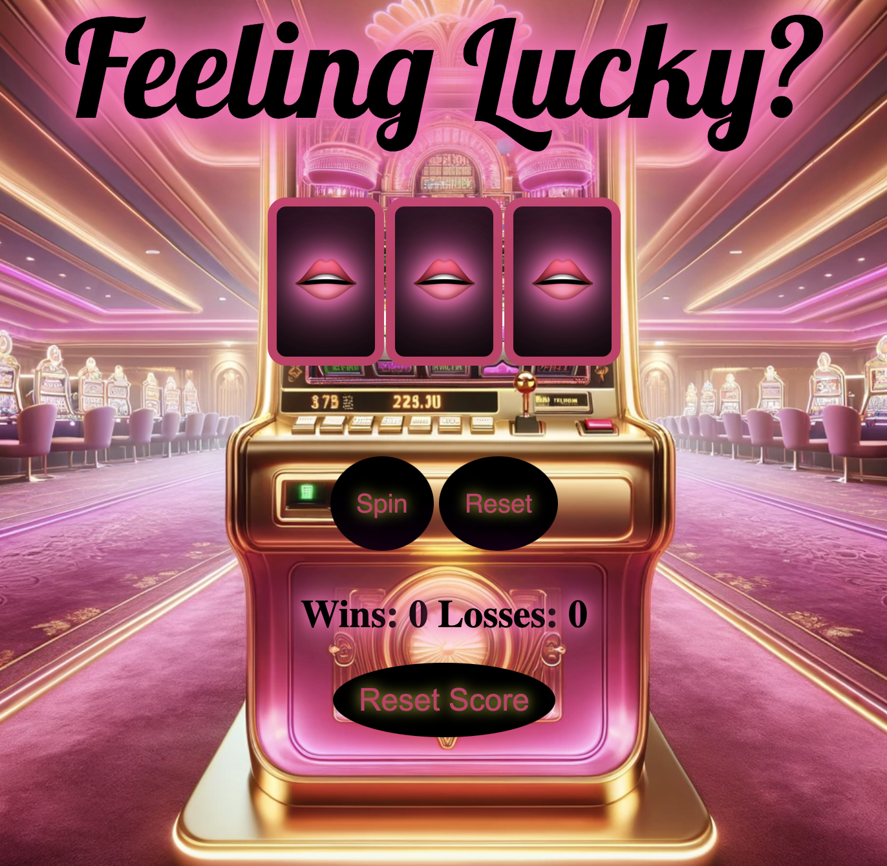

# Slot Machine Game


Are you feeling lucky? Let's test your luck by spinning the slot machine and aiming for a winning combination. Be strategic, as you only have three chances to win!

## How to Play




1. **Spin the Slot Machine:**
   - Press the "Spin" button to initiate a spin of the slot machine.
   - Watch as the doors spin and come to a stop, revealing your result.

2. **Reset the Game:**
   - After each spin, press the "Reset" button to prepare for the next round.
   - The "Reset" button will clear the current result and allow you to spin again.

3. **Chances:**
   - You start with three chances to win.
   - Each time you press the "Spin" button, one chance is used.
   - The game ends when you reach zero chances.
   - After the game ends, you can reset score and try your luck again!

## Getting Started

1. **Clone this repository:**

   ```bash
   git clone https://github.com/aldianahot14/Slot-Machine
